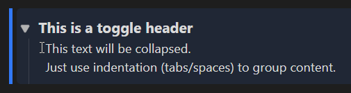

# Inline Toggles for Obsidian

Inline Toggles brings **Notion-style** collapsible sections directly to your Markdown lines. The collapse state is saved directly in your file (`%%⏷%%` / `%%⏵%%`), ensuring your view remains perfectly synced across desktop and mobile.

## ✨ Why Inline Toggles?

Unlike standard Obsidian callouts, Inline Toggles offer a more fluid writing experience:
- **Interactive Widgets**: In Live Preview, toggles become clickable icons to instantly expand or collapse sections.
- **No Syntax Overhead**: Stop prefixing every line with `>`. Just write normal text or indented lists.
- **No Layout Jumps**: Editing content doesn't force the view to switch to raw source code. You type exactly where you read.
- **Reliable State**: Your vault remembers what was collapsed—even after syncing or restarting Obsidian.
- **Flexible Placeholders**: Use any symbols you like to define your toggles. While `%%` is the default, you can customize the border and icons to fit your aesthetic.

## 🚀 Usage

### Basic Syntax

| Source Mode (Markdown) | Live Preview (Result) |
| :--- | :--- |
| `%%⏷type: info%%` This is a toggle header &nbsp;&nbsp;&nbsp;&nbsp;This text will be collapsed. &nbsp;&nbsp;&nbsp;&nbsp;Just use indentation to group content. |  |

### Commands & Hotkeys
- **Insert/Remove Toggle**: e.g., set to `Ctrl/Cmd + Shift + L`
- **Edit Attributes**: Opens a modal for quick styling (via command or **Right-Click** on the widget).
- **Change Type**: Cycle through callout types (via command or **Right-Click** on the widget).

## 🎨 Styling & CSS

You can add CSS attributes to any toggle (e.g., `%%⏷type: info; bg: rgba(0,100,255,0.1)%%`).

- **Shorthands**: `type` (presets), `bg` (background), `col` (color), `border` (left border).
- **Free CSS**: Use any valid CSS attribute (e.g., `opacity: 0.5`).
- **End Styling**: Block styling stops automatically at the end of the collapsed section or as soon as a horizontal rule (`---`) appears in the text.

## ⚙️ Settings & Migration

> [!CAUTION]
> ### ⚠️ Important: Create a Backup!
> The **"Migrate Entire Vault"** and **"Remove All Toggles"** features modify many files at once. **Always** create a backup of your vault before using these tools.

---
*Disclaimer: This plugin is not affiliated with or endorsed by Notion Labs, Inc. It provides a similar user experience within Obsidian.*

Developed by [Niklas Tran](https://github.com/N1ktra)
